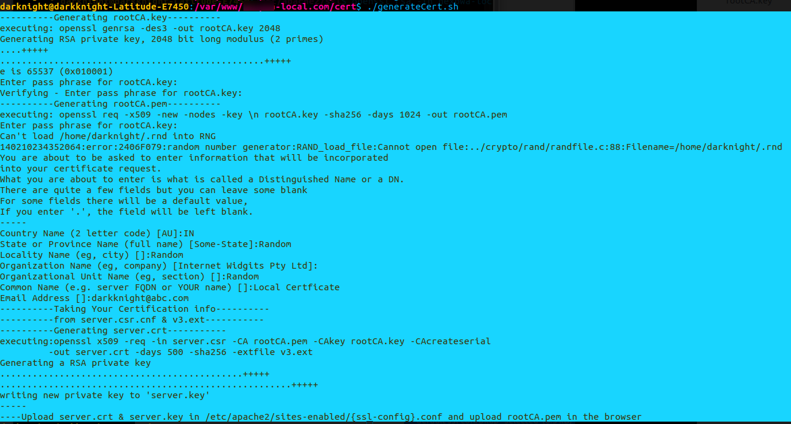
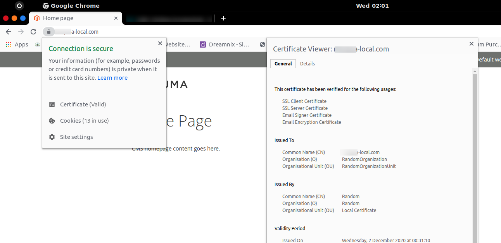

### SSL Cert to your local apache2 Virtual Host

1. Make a Virtual SIte

   a. Install Apache2

   ```
   sudo apt update
   sudo apt install apache2
   ```
   
   b. your virtual host path
   
   ```
   sudo mkdir -p /var/www/example-local.com/public_html
   ```
   
   c. Grant Permission
   
   ```
   sudo chown -R $USER:$USER /var/www/example.com/public_html
   ```
   
   d. Create A html file to verify
   
   ```
   nano /var/www/example.com/public_html/index.html
   ```
   
   > > content
   
   ```html
   <html>
     <head>
       <title>Welcome to example-local .com!</title>
     </head>
     <body>
       <h1>Success!  The example-local.com virtual host is working!</h1>
     </body>
   </html>
   ```
   
   e. make a virtual host file
   
   ```bash
   sudo cp /etc/apache2/sites-available/000-default.conf /etc/apache2/sites-available/example-local.com.conf
   ```
   
   > > content
   
   ```html
   <VirtualHost 127.0.99.9:80>
   	# give any available ip address
   	# The ServerName directive sets the request scheme, hostname and port that
   	# the server uses to identify itself. This is used when creating
   	# redirection URLs. In the context of virtual hosts, the ServerName
   	# specifies what hostname must appear in the request's Host: header to
   	# match this virtual host. For the default virtual host (this file) this
   	# value is not decisive as it is used as a last resort host regardless.
   	# However, you must set it for any further virtual host explicitly.
   	#ServerName www.example.com
   	<Directory /var/www/example-local.com/public_html>
                   Options Indexes FollowSymLinks MultiViews
                   AllowOverride All
                   Order allow,deny
                   allow from all
           </Directory>
   
   	ServerAdmin admin@example-local.com
   	ServerName example-local.com
   	ServerAlias www.example-local.com
   	DocumentRoot /var/www/example-local.com/public_html
   
   	# Available loglevels: trace8, ..., trace1, debug, info, notice, warn,
   	# error, crit, alert, emerg.
   	# It is also possible to configure the loglevel for particular
   	# modules, e.g.
   	#LogLevel info ssl:warn
   
   	ErrorLog ${APACHE_LOG_DIR}/error.log
   	CustomLog ${APACHE_LOG_DIR}/access.log combined
   
   	# For most configuration files from conf-available/, which are
   	# enabled or disabled at a global level, it is possible to
   	# include a line for only one particular virtual host. For example the
   	# following line enables the CGI configuration for this host only
   	# after it has been globally disabled with "a2disconf".
   	#Include conf-available/serve-cgi-bin.conf
   </VirtualHost>
   
   # vim: syntax=apache ts=4 sw=4 sts=4 sr noet
   ```
   
   f. Enable the new virtual host and disable the old for verification
   
   ```bash
   sudo a2ensite example-local.com.conf
   sudo a2dissite 000-default.conf
   sudo nano /etc/hosts
   ```
   
   > > content
   
   ```bash
   127.0.99.9 example-local.com
   ```
   
   

2. Generate Certification Ps: I have already written all required things in a bash script 

   1. Execute the bash script: generateCert.sh

   > > command

   ```bash
    $./generateCert.sh 
   ```

   2. Screenshot for Reference

   ​	

3. Create example-local.ssl.com.conf in /etc/apache2/site-available

   {copy the server.crt, server.key to /etc/apache2/ssl/ }

   ```html
   <IfModule mod_ssl.c>
   	<VirtualHost 127.0.99.9:443>
   	
   		<Directory /var/www/example-local.com/public_html>
                   	Options Indexes FollowSymLinks MultiViews
                   	AllowOverride All
                   	Order allow,deny
                   	allow from all
           	</Directory>
   		ServerAdmin webmaster@example-local.com
   		
   		DocumentRoot /var/www/example-local.com/public_html
   
   		#   SSL Engine Switch:
   		#   Enable/Disable SSL for this virtual host.
   		SSLEngine on
           
   		SSLCertificateFile /etc/apache2/ssl/example-local.crt #(server.crt)
           SSLCertificateKeyFile /etc/apache2/ssl/example-local.key #(server.key)
   		
   		
   		<FilesMatch "\.(cgi|shtml|phtml|php)$">
   				SSLOptions +StdEnvVars
   		</FilesMatch>
   		<Directory /usr/lib/cgi-bin>
   				SSLOptions +StdEnvVars
   		</Directory>
   
   	</VirtualHost>
   </IfModule>
   
   # vim: syntax=apache ts=4 sw=4 sts=4 sr noet
   ```

4. Go to Chrome Settings 

> >chrome://settings/certificates?search=site
> >
> >-Authorities Tab > Import your rootCA.pem which has been generated

5. Enable SSL Site and Reload Apache systemctl

   ```
   sudo a2ensite example-local.ssl.com.conf
   sudo systemctl reload apache2 
   sudo systemctl restart apache2
   ```

> > Restart Browser and Apache and Clear Browser Application Storage if its required


